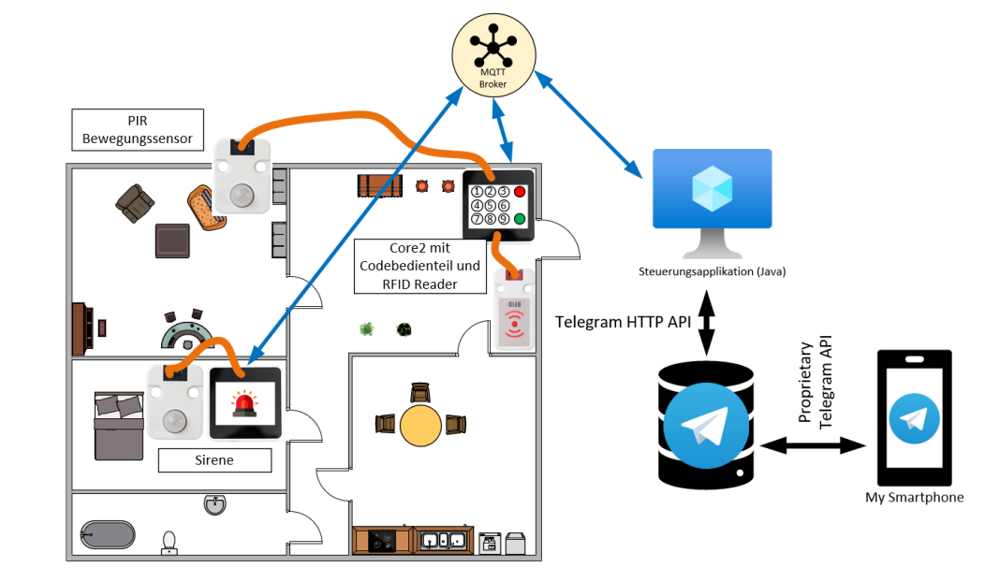

# AlarmanlageCore2

## Einleitung

Das Projekt beinhaltet den Bau eines Modells eines Hauses oder einer Wohnung mit 2 Räumen und einer Eingangstür. Es wird eine Alarmanlage entwickelt, die über zwei Zustände verfügt: Anwesend und Abwesend. 

## Hardware

Die Alarmanlage besteht aus zwei M5 Stack Core2-Boards, zwei PIR-Sensoren und einen RFID Sensor. Die PIR Sensoren sind an den Core2-Boards angeschlossen. Das zweite Core2-Board fungiert als Codebedienteil und ist neben der Eingangstüre außerhalb des Hauses platziert.

## Funktionsweise

Die Steuerung der Alarmanlage erfolgt über eine Steuerungsapplikation, die über einen Telegram Bot ein- oder ausgeschaltet werden kann. Die Alarmierung erfolgt mithilfe des Lautsprechers und integrierten LEDs der beiden Core2. Sobald einer der beiden PIR-Sensoren eine Bewegung erkennt, löst die Alarmanlage im abwesenden Zustand einen optischen und akustischen Alarm aus. Es ist jedoch nicht möglich, die Alarmanlage einzuschalten, solange die PIR-Sensoren Bewegungen erkennen.

Das Codebedienteil befindet sich neben der Eingangstür außerhalb des Hauses und ermöglicht das Ein- und Ausschalten der Alarmanlage mit einem 4-stelligen Code oder einem RFID-Badge. Es können bis zu drei verschiedene Codes programmiert werden. Der Code kann auch direkt am Codebedienteil geändert werden.

Die Alarmanlage kann über den Telegram Bot in den Zuständen "Anwesend" und "Abwesend" geschaltet werden. Der Zustand der Alarmanlage, ob "Kein Alarm" oder "Alarm", kann ebenfalls über den Telegram Bot abgefragt werden. Bei einem Alarm werden die Bewohner per Telegram Bot informiert. Der akustische Alarm stellt sich nach 30 Sekunden ab oder wenn die Alarmanlage über das Codebedienteil auf den Zustand "Anwesend" gestellt wurde. Der optische Alarm bleibt so lange bestehen, bis die Alarmanlage über das Codebedienteil auf den Zustand "Anwesend" gestellt wurde.

## Dokumentation

Das System wurde vollständig getestet und die durchgeführten Tests wurden dokumentiert. Eine Benutzeranleitung in Form eines Videos liegt ebenfalls vor.
